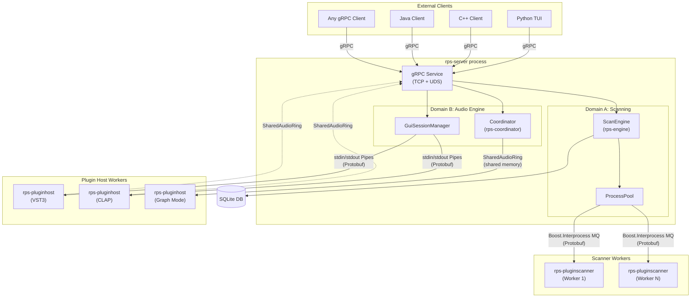
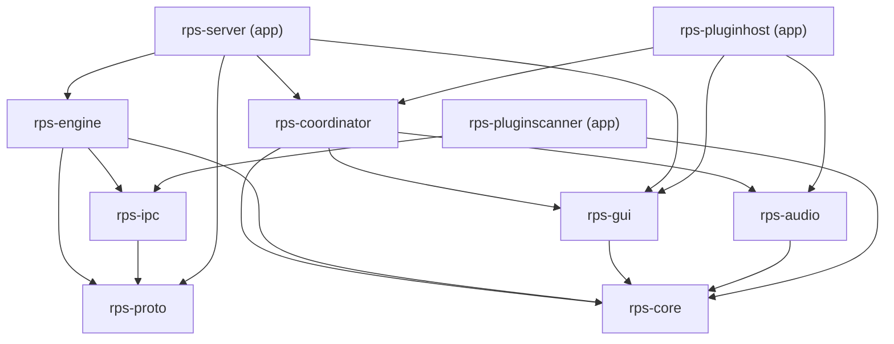
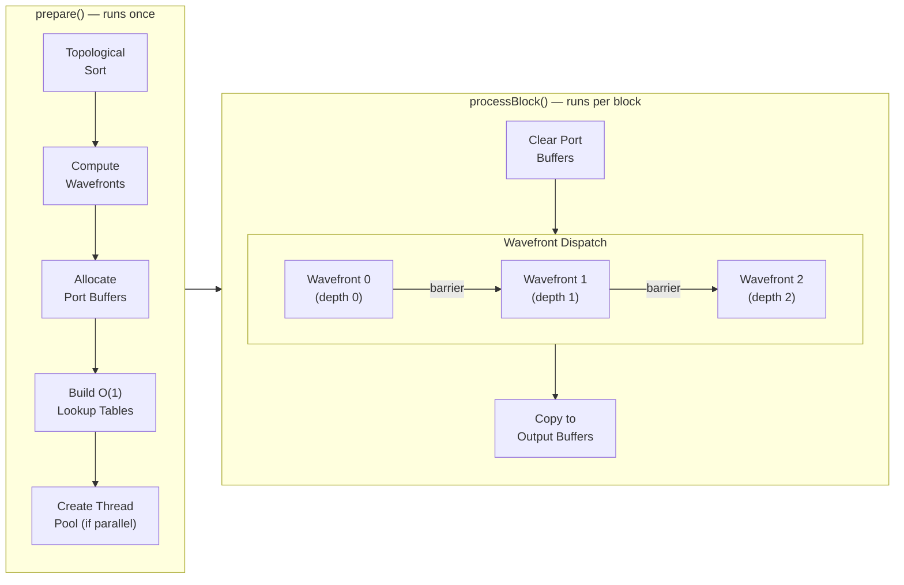

# RPS Architecture

> **Audience:** Developers, contributors, and AI agents working on the RPS codebase. This document explains the full system design — its two major domains, how they interact, and the rationale for every major design decision.

---

## 1. Executive Summary

**RPS** is a cross-platform audio infrastructure system built on a **multi-process architecture** for unconditional stability. It consists of **two distinct domains** that share a common foundation of crash-isolated processes, shared memory audio transport, and a gRPC control plane:

### Domain A: Plugin Scanning Infrastructure

A robust, parallel plugin scanning system that discovers and catalogs audio plugins (VST2, VST3, CLAP, AAX, AU, LV2, LADSPA) across Windows, macOS, and Linux. Each plugin is scanned in a disposable worker process — a crash in one plugin never affects any other. Results are stored in a SQLite database. This was the original purpose of RPS and remains a fully functional, standalone subsystem.

### Domain B: Audio Engine & Plugin Hosting

A **graph-based, out-of-process audio engine** capable of hosting multiple plugins in arbitrary DAG topologies with complex channel routing, parallel wavefront execution, and CPU topology-aware scheduling. Currently supports **VST3** and **CLAP** plugins. This is the system's primary growth direction — the foundation for DAW-class audio processing. It includes:

- **Single-plugin hosting** with native GUI embedding (SDL3 + ImGui sidebar)
- **Multi-plugin graph processing** with typed nodes (Input, Output, Plugin, Mixer, Gain, Router, Downmix, Send, Receive)
- **Zero-allocation real-time audio path** with pre-computed O(1) buffer lookups
- **Parallel wavefront executor** with generation-counter thread pool synchronization
- **CPU topology awareness** — hybrid P-core/E-core detection, thread affinity, and MMCSS/QoS integration

### Three Pillars

Both domains are built on the same principles:

1. **Crash Isolation** — Third-party plugin code runs in disposable worker processes. If a plugin crashes, only the worker dies. The server, the database, and all other plugins survive.
2. **Performance** — Lock-free shared memory audio transport, parallel wavefront graph execution, and CPU topology-aware thread scheduling deliver professional-grade latency and throughput.
3. **Developer Accessibility** — A gRPC API exposes every feature to any programming language. No C++ knowledge is needed to drive RPS.

The architecture is built around a core insight: **plugin code cannot be trusted**. Plugins crash during initialization, hang during iLok license checks, write to stdout, corrupt memory, and deadlock during cleanup. RPS treats every plugin interaction as a potentially hostile operation and structures the entire system to contain failures.

---

## 2. Design Philosophy

### 2.1 Multi-Process by Default

Most DAWs and plugin hosts load plugins as in-process dynamic libraries (`.dll`, `.so`, `.dylib`). This is fast but fragile — a single bad plugin can crash the entire application.

RPS makes a deliberate trade-off: **processes over threads**. Every plugin interaction that touches third-party code happens in a separate worker process. The cost is IPC overhead; the benefit is unconditional stability. This trade-off is justified because:

- Plugin loading and scanning are inherently I/O-bound (disk reads, network license checks).
- Audio processing uses shared memory, eliminating most of the IPC overhead for the latency-critical path.
- Modern OS schedulers can distribute processes across cores better than in-process thread pools when the workload involves independent, long-running tasks.

### 2.2 Control Plane vs. Data Plane

RPS strictly separates its communication channels:

| Plane | Technology | Used For | Latency |
|-------|-----------|----------|---------|
| **Control** | gRPC (TCP + UDS), Protobuf over pipes/MQs | Commands, events, metadata, state | ~1 ms |
| **Data** | Shared memory (`SharedAudioRing`) | Audio sample data | ~μs |

This separation means the audio path never touches the network stack, serialization, or memory allocation. The control plane can tolerate higher latency because it carries infrequent messages (parameter changes, preset loads, graph reconfiguration).

### 2.3 Zero Trust in Plugin Code

Every boundary where third-party plugin code runs is defended:

- **Process isolation**: Plugins run in worker processes. Crashes are caught and logged, not propagated.
- **SEH wrapping (Windows)**: Plugin `loadPlugin()`, `setupAudioProcessing()`, and `processAudioBlock()` calls are individually wrapped in Structured Exception Handlers. A crash in one call logs the exception and falls through gracefully.
- **Watchdog timers**: Scanner workers that stop sending progress heartbeats are killed after a configurable timeout.
- **UI suppression**: Scanner workers on Windows run in a Job Object with `JOB_OBJECT_UILIMIT_HANDLES`, silently blocking `MessageBox()` calls from plugins that would otherwise hang the process.
- **Stdout protection**: Plugin host workers redirect stdout → stderr before loading any plugin code, preserving the IPC pipe from pollution.

### 2.4 Technology Constraints

| Constraint | Rationale |
|-----------|-----------|
| **C++23** | Required for `std::format`, `std::expected`, `std::ranges`, `std::barrier`, `std::move_only_function`. C++ is the industry standard for audio programming. |
| **Minimal dependencies** | Only STL, Boost, SQLite, gRPC/Protobuf, spdlog, SDL3, Dear ImGui. No JUCE, no nlohmann/json, no framework lock-in. |
| **Static linking everywhere** | All binaries are fully self-contained. No missing DLL failures at runtime. Managed via vcpkg across all platforms. |
| **Phased delivery** | Each phase produces working, verifiable code with tests. No big-bang integrations. |

### 2.5 Two Domains, One Foundation

While scanning and the audio engine serve different use cases, they share the same process model, IPC primitives, and infrastructure libraries. This is intentional: code that solves crash isolation for scanning directly benefits the audio engine, and vice versa. The gRPC API exposes both domains through a single server process.

---

## 3. High-Level Architecture



The two domains and their subsystems:

| Domain | Subsystem | Purpose | Key Components |
|--------|-----------|---------|----------------|
| **A: Scanning** | Plugin Scanning | Discover and catalog plugins across all formats | `rps-engine`, `ProcessPool`, `rps-pluginscanner`, SQLite |
| **B: Audio** | Single-Plugin Hosting | Load one plugin, show its GUI, process audio | `rps-gui`, `rps-pluginhost-{vst3,clap}`, `SharedAudioRing` |
| **B: Audio** | Graph Audio Engine | Multi-plugin processing with arbitrary DAG routing | `rps-coordinator`, `GraphExecutor`, `rps-pluginhost` (graph mode) |

---

## 4. Repository Layout

```
rps/
├── apps/
│   ├── rps-server/            # gRPC server daemon
│   ├── rps-standalone/        # CLI scanner (no server needed)
│   ├── rps-pluginscanner/     # Isolated scanner worker
│   ├── rps-pluginhost/        # Plugin host worker (VST3, CLAP, graph mode)
│   └── rps-vstscannermaster/  # Steinberg-compatible VST3 cache generator
├── libs/
│   ├── rps-core/              # Format traits, registry, filesystem discovery, logging
│   ├── rps-ipc/               # IPC transport (MQ + pipe connections)
│   ├── rps-engine/            # Scan orchestration, ProcessPool, SQLite
│   ├── rps-proto/             # Generated Protobuf/gRPC stubs
│   ├── rps-gui/               # Shared GUI hosting (IPluginGuiHost, SdlWindow)
│   ├── rps-audio/             # Shared memory audio transport (SharedAudioRing)
│   ├── rps-coordinator/       # Graph model, executor, graph worker, serialization
│   └── rps-host/              # Host abstraction layer
├── proto/
│   ├── rps.proto              # gRPC service + client messages
│   ├── scanner.proto          # Scanner IPC messages
│   └── host.proto             # Plugin host IPC messages
├── examples/
│   ├── python/                # Python TUI client (rich, click, InquirerPy)
│   ├── cpp/                   # C++ gRPC client with ANSI TUI
│   └── java/                  # Java gRPC client
└── plans/                     # Architecture and implementation plans
```

### Library Dependency Graph



Key dependency principles:
- **`rps-core`** is at the bottom — no dependencies beyond STL and Boost.
- **`rps-audio`** (shared memory) and **`rps-ipc`** (message queues/pipes) have no mutual dependency.
- **`rps-coordinator`** depends on `rps-audio` for shared memory audio transport but not on `rps-engine` or `rps-ipc`.
- **`rps-server`** is the top-level integrator that links everything together.

---

## 5. Process Architecture & IPC

RPS uses four distinct IPC mechanisms, each chosen for a specific communication pattern:

### 5.1 Scanner Path: Boost.Interprocess Message Queues

```
rps-server          rps-pluginscanner
┌──────────┐        ┌──────────────┐
│ProcessPool│──MQ──►│ main.cpp     │
│          │◄──MQ──│ Vst3Scanner  │
│          │        │ ClapScanner  │
└──────────┘        └──────────────┘
     │                    │
     └── stderr capture ──┘
```

- Each worker gets two named message queues (TX and RX) identified by a UUID.
- Messages are Protobuf-serialized `ScanCommand` (engine → worker) and `ScannerEvent` (worker → engine).
- **Why MQs, not pipes?** Scanner workers are crash-prone. Using MQs keeps the IPC channel independent from the process's stdout/stderr, allowing stderr to be captured separately for crash diagnostics. If a plugin writes to stdout (many do), MQ-based IPC is unaffected.

### 5.2 Plugin Host Path: stdin/stdout Pipes

```
rps-server              rps-pluginhost-vst3
┌───────────────┐       ┌──────────────────┐
│GuiSessionMgr │──pipe─►│ stdin (commands)  │
│               │◄─pipe─│ stdout* (events)  │
└───────────────┘       │ stderr (logs)     │
                        └──────────────────┘
*original fd, after dup2 redirect
```

- Wire format: `[4-byte uint32_t length, LE][N-byte Protobuf payload]`.
- At startup, the host saves the original stdout fd, then redirects stdout → stderr via `dup2`. The saved fd is used for IPC. Any plugin stdout goes harmlessly to stderr/logs.
- **Why pipes, not MQs?** Plugin hosts are interactive, long-lived processes (not crash-and-restart like scanners). Pipes are simpler — no named shared resources to clean up, no UUID coordination.

### 5.3 Audio Data Path: SharedAudioRing

```
Producer (server/client)      Consumer (pluginhost)
┌────────────────────┐        ┌────────────────────┐
│  writeInputBlock() │───SM──►│  readInputBlock()  │
│  readOutputBlock() │◄──SM───│  writeOutputBlock() │
└────────────────────┘        └────────────────────┘
     SM = shared memory segment
     Signaling: OS events (Windows) / semaphores (POSIX)
```

- **SPSC (Single Producer, Single Consumer) lock-free ring buffer** over named shared memory.
- Cache-line-aligned atomic read/write indices prevent false sharing.
- OS-level signaling (Windows events / POSIX semaphores) for efficient wake-ups — no polling, no spin-waits, no `sleep_for`.
- Header contains audio format metadata (sample rate, block size, channels) and extension points for transport state.
- **Why shared memory?** Zero-copy, sub-microsecond latency. Audio data (hundreds of KB per second) must never touch the network stack or serialization layer.

### 5.4 gRPC Control Plane

- **Dual transport**: TCP (`0.0.0.0:{port}`) and Unix Domain Sockets (`{temp}/rps-server-{port}.sock`) simultaneously.
- Local clients (Python spawning the server) connect via UDS, bypassing the TCP/IP stack.
- Remote clients connect via TCP as usual.
- Streaming RPCs (`StartScan`, `OpenPluginGui`) push events to clients in real time.
- **Why gRPC?** Language-agnostic (Python, C++, Java, Go, Rust clients work out of the box), built-in streaming, code generation, and a mature ecosystem. The alternative (custom TCP protocol) would require maintaining client libraries in every language.

---

## 6. Plugin Scanning Subsystem

### 6.1 Flow

```
Client → StartScan RPC → ScanEngine.runScan()
                              │
                    ┌─────────▼─────────┐
                    │    ProcessPool     │
                    │  (N worker slots)  │
                    └──┬──┬──┬──┬──┬──┬─┘
                       │  │  │  │  │  │
            ┌──────────▼──▼──▼──▼──▼──▼──────────┐
            │     rps-pluginscanner (workers)      │
            │  Vst3Scanner | ClapScanner | ...     │
            └──────────────────────────────────────┘
                              │
                    ┌─────────▼─────────┐
                    │   ScanObserver     │
                    │  (Console / gRPC)  │
                    └─────────┬─────────┘
                              │
                    ┌─────────▼─────────┐
                    │  DatabaseManager   │
                    │     (SQLite)       │
                    └───────────────────┘
```

### 6.2 Crash Isolation & Watchdog

1. Engine spawns a worker via `boost::process` with the target plugin path.
2. On Windows, the worker is assigned to a Job Object that blocks `MessageBox()` calls.
3. The worker calls `SetErrorMode()` to suppress OS crash dialogs.
4. The engine monitors a `lastResponseTime` timestamp, reset on every `ProgressEvent`.
5. If the worker dies: engine logs the exit code, records the failure, moves to the next plugin.
6. If the worker is silent beyond the timeout: engine kills it, records a timeout, and retries (up to N attempts).
7. After exhausting retries, the plugin is added to `plugins_blocked` and skipped on future incremental scans.

### 6.3 Scanner Process Lifecycle

Plugins frequently hang during cleanup (`DLL_PROCESS_DETACH` on Windows, `dlclose` on POSIX). RPS handles this:

- **Scanner side**: Uses `TerminateProcess(GetCurrentProcess(), 0)` on Windows to skip `DLL_PROCESS_DETACH`. Uses `_exit(0)` on POSIX.
- **Engine side**: After receiving the scan result, immediately calls `terminate()` on the child process. No grace period.

### 6.4 Incremental Scanning

- Default mode. Loads caches from `plugins`, `plugins_skipped`, and `plugins_blocked` tables.
- Compares file modification time (`mtime`) against cached values.
- Only new or changed plugins are dispatched for scanning.
- Stale entries (plugins that no longer exist on disk) are automatically pruned.
- Format-aware: scanning `--formats vst3` never touches AAX or CLAP data.

### 6.5 Database Design

SQLite with **WAL journal mode** and **explicit transactions**. Without explicit transactions, a plugin with 2000+ parameters takes 30–50 seconds to persist. With them: under 50ms.

| Table | Purpose |
|-------|---------|
| `plugins` | Main scan results (one row per plugin) |
| `parameters` | Plugin parameters (1:N) |
| `aax_plugins` | AAX-specific variant data |
| `vst3_classes` | VST3 multi-class entries |
| `vst3_compat_uids` | VST3 compatibility UIDs |
| `plugins_skipped` | Non-scannable plugins (empty bundles, etc.) |
| `plugins_blocked` | Plugins that exhausted retries |

---

## 7. Plugin Hosting Subsystem (Single-Plugin)

### 7.1 Architecture

Each plugin format has a dedicated host worker process:

| Process | Format | Key File |
|---------|--------|----------|
| `rps-pluginhost-vst3` | VST3 | `Vst3GuiHost.cpp` |
| `rps-pluginhost-clap` | CLAP | `ClapGuiHost.cpp` |

Both implement the shared `IPluginGuiHost` interface from `libs/rps-gui/`:

```cpp
class IPluginGuiHost {
    virtual void loadPlugin(const fs::path& path) = 0;
    virtual std::optional<AudioBusLayout> setupAudioProcessing(
        uint32_t sampleRate, uint32_t blockSize, uint32_t channels) = 0;
    virtual void processAudioBlock(
        const float* in, float* out,
        uint32_t inCh, uint32_t outCh, uint32_t blockSize) = 0;
    virtual void teardownAudioProcessing() = 0;
    // ... GUI, presets, state, parameters
};
```

### 7.2 GUI Shell

`SdlWindow` creates an SDL3 window and embeds the plugin's native editor view. An ImGui sidebar provides:
- Searchable multi-column preset browser.
- Parameter display.
- State save/restore controls.

The sidebar uses the **"Stationary Content" pattern** — the plugin editor remains stationary while the sidebar expands/collapses, avoiding the Windows Airspace Problem with child HWND positioning.

### 7.3 Audio Processing Path

When audio is enabled (`--audio-shm`):
1. `GuiWorkerMain` spawns a dedicated real-time audio thread.
2. On Windows, the thread is elevated to **AVRT Pro Audio** priority.
3. The audio thread reads from `SharedAudioRing`, deinterleaves, calls `processAudioBlock()`, interleaves, and writes back.
4. Total roundtrip: shared memory read → plugin processing → shared memory write.

---

## 8. Graph-Based Audio Engine

The graph engine extends RPS from a single-plugin host to a **multi-plugin audio processing system** with arbitrary routing. This is the foundation for DAW-class audio processing.

### 8.1 Graph Model

A graph is a validated DAG (Directed Acyclic Graph) of typed audio processing nodes:

| Node Type | In Ports | Out Ports | Description |
|-----------|----------|-----------|-------------|
| `InputNode` | 0 | 1 | Entry point. Receives audio from external source. |
| `OutputNode` | 1 | 0 | Exit point. Delivers processed audio to client. |
| `PluginNode` | 1 | 1 | Wraps an `IPluginGuiHost`. Processes through a plugin. |
| `MixerNode` | K | 1 | Sums K inputs with per-input gain. 64-bit accumulation. |
| `GainNode` | 1 | 1 | Per-channel gain, mute, bypass. |
| `ChannelRouterNode` | 1 | 1 | Reorders/extracts specific channels. |
| `DownmixNode` | 1 | 1 | Speaker-layout-aware fold-down (e.g., 7.1.4 → stereo). |
| `SendNode` | 1 | 0 | Writes audio to shared memory (inter-process bridging). |
| `ReceiveNode` | 0 | 1 | Reads audio from shared memory. |
| `SidechainInputNode` | 0 | 1 | External sidechain audio input. |

Each node has typed ports with `ChannelLayout` (format + channel count). Edges connect output ports to input ports. The graph validator checks:
- Acyclic structure (no cycles)
- All required ports connected
- Channel format compatibility on edges
- At least one InputNode and one OutputNode

### 8.2 GraphExecutor

The executor processes a validated graph one audio block at a time:



**Wavefront parallelism**: Nodes at the same topological depth have no data dependencies and can execute in parallel on different cores. Example:

```
InputNode → PluginA ─┐
                      ├─→ MixerNode → OutputNode
InputNode → PluginB ─┘
```

`PluginA` and `PluginB` are at depth 1 — they run in parallel. `MixerNode` is at depth 2 — it waits until both are done.

**Two execution modes** (auto-detected in `prepare()`):

| Mode | Condition | Overhead |
|------|-----------|----------|
| **Serial** | All wavefronts have exactly 1 node | Zero — simple `for` loop |
| **Parallel** | Any wavefront has >1 node | Thread pool + generation-counter sync |

**Thread pool design**:
- Fixed-size pool created in `prepare()`, joined in destructor.
- **Generation-counter pattern**: Workers wait on a condition variable. When a new wavefront is dispatched, the generation counter increments. Workers wake, grab tasks via atomic `fetch_add`, and process nodes. When all tasks complete, `doneCV` signals the main thread.
- **Main thread participates** in work-stealing — no idle core during dispatch.
- Single-node wavefronts bypass the pool entirely and run on the calling thread.
- Default thread count: `min(hardware_concurrency / 2, 8)`. Phase 6 refines this to P-core count.

### 8.3 Zero-Allocation Hot Path

The `processBlock()` method and all `process*Node()` methods perform **zero heap allocations**:

| What | How |
|------|-----|
| Port buffers | Pre-allocated `AudioBuffer`s in `prepare()`, stored in `m_portBuffers` |
| Output buffer lookup | `m_nodeOutputBuffer`: nodeId → `AudioBuffer*` pointer, built in `prepare()` |
| Input buffer lookup | `m_inputBufferLookup`: (nodeId, portIndex) → `AudioBuffer*`, built from edges in `prepare()` |
| Plugin scratch buffers | Pre-allocated interleaved `std::vector<float>` per plugin node in `GraphWorkerMain`, reused every block |
| I/O maps | `std::unordered_map<string, AudioBuffer>` for inputs/outputs, created once before the audio loop |

No `std::string` formatting, no `std::format`, no `std::vector` resize, no `new`/`malloc` on the audio thread. All string-keyed lookups are resolved to direct pointer dereferences in `prepare()`.

### 8.4 GraphWorkerMain

`GraphWorkerMain` is the entry point when `rps-pluginhost` runs in graph mode:

1. Parse graph JSON from `--graph` or `--graph-file`.
2. Validate the graph.
3. Load all `PluginNode` plugins (with SEH crash protection per plugin on Windows).
4. Pre-allocate all scratch buffers (Phase 4 hardening).
5. Prepare the `GraphExecutor` (computes wavefronts, creates thread pool if needed).
6. Open `SharedAudioRing` from `--audio-shm`.
7. Enter the audio loop:
   - Read interleaved input from shared memory.
   - Deinterleave into pre-allocated input buffer.
   - Call `executor.processBlock()`.
   - Interleave output.
   - Write to shared memory.

### 8.5 Latency Calculation

`LatencyCalculator` traverses the graph and sums plugin-reported latencies along each path from input to output. The maximum path latency per output is reported. This is used by Phase 9 (PDC) to insert compensating delay nodes.

---

## 9. Real-Time Audio Path Design

### 9.1 The Golden Rule

> **No allocation on the audio thread. Ever.**

This rule exists because:
- `malloc()`/`new` takes a global lock. On a multi-threaded executor, this serializes all threads.
- Heap allocation latency is unbounded — it can trigger OS virtual memory operations.
- On heterogeneous CPUs, efficiency cores run at lower clock speeds. Any allocator stall that's "fine" on a P-core becomes a glitch on an E-core.

### 9.2 How It's Enforced

- **Structural**: All buffers and lookup tables are built in `prepare()` (which is called once, outside the audio loop). The `process*Node()` methods only copy, add, and multiply floats.
- **API contract**: `processOutputNode` throws if the output buffer wasn't pre-allocated. Callers must be correct — no silent fallback allocations.
- **Planned (Phase 4 verification)**: A debug-build RAII guard that overrides `operator new` to `assert(false)` during `processBlock()`. This catches regressions deterministically in CI.

### 9.3 64-Bit Summing

`MixerNode` accumulates in `double` (64-bit) and outputs as `float` (32-bit). This prevents floating-point precision loss when summing many inputs — a common source of subtle artifacts in large mixes. The `mixIn()` method uses double accumulation internally.

---

## 10. Parallel Execution & CPU Topology

### 10.1 Wavefront Parallelism

Traditional DAW audio engines process plugins serially. If a graph has 8 independent effect chains merging at a mixer, a serial engine wastes 7/8 of available CPU time.

RPS computes **wavefronts** — groups of nodes at the same topological depth — and dispatches each wavefront to a thread pool. This is the most impactful optimization for multi-core utilization:

| Graph Shape | Serial Usage | Parallel Usage |
|-------------|-------------|----------------|
| 2 parallel chains | 50% | ~100% |
| 8 parallel chains | 12.5% | ~100% |
| Pure serial chain | 100% | 100% (serial fallback, zero overhead) |

### 10.2 Thread Pool Design

The thread pool uses a **generation-counter pattern** instead of `std::barrier`:

1. Workers loop: wait on `m_startCV` for `m_generation > localGen`.
2. Main thread increments generation, stores wavefront info, notifies all workers.
3. Workers and main thread both grab tasks via `m_nextTask.fetch_add()`.
4. Last thread to complete signals `m_doneCV`.
5. Main thread waits on `m_doneCV`, then advances to the next wavefront.

This pattern was chosen over `std::barrier` because:
- It allows the main thread to participate in work-stealing (no idle core).
- Single-node wavefronts bypass the pool entirely (zero overhead for serial sections).
- No unnecessary wake-ups — workers only wake when there's actual work.

### 10.3 CPU Topology Awareness

Modern CPUs have heterogeneous cores. The `CpuTopology` module (`rps-core`) provides cross-platform discovery, thread affinity, and priority management:

| Platform | Discovery API | P/E Classification | Thread Affinity | Audio Priority |
|----------|--------------|---------------------|-----------------|----------------|
| **Windows** | `GetSystemCpuSetInformation()` | `EfficiencyClass` field | `SetThreadAffinityMask` | MMCSS `Pro Audio` |
| **macOS** | `sysctl("hw.nperflevels")` | Perf-level count | No-op (uses QoS instead) | `QOS_CLASS_USER_INTERACTIVE` |
| **Linux** | `/sys/devices/system/cpu/cpuN/cpufreq/cpuinfo_max_freq` | 90% threshold heuristic | `pthread_setaffinity_np` | `SCHED_FIFO` priority 80 |
| **Other** | `hardware_concurrency()` | All Unknown | No-op | No-op |

Integration with the audio engine:
- **`GraphExecutor::prepare()`** discovers the topology and uses P-core count (minus 1 for the main thread) to size the thread pool on hybrid CPUs. Falls back to `min(hw/2, 8)` on homogeneous systems.
- **`GraphExecutor::workerLoop()`** pins each worker thread to P-cores and sets real-time priority at startup.
- **Thread pool sizing**: On a 8P+8E Intel CPU, the pool gets 7 workers — all pinned to P-cores, leaving E-cores for background work and the OS.

---

## 11. Multi-Process Slicing & Coordination (Phase 7 — Planned)

### 11.1 Why Slice?

A single `rps-pluginhost` process hosts an entire subgraph. But some graphs are too large or contain plugins from different vendors that shouldn't share a process (for crash isolation):

| Strategy | Rationale |
|----------|-----------|
| **Vendor isolation** | A crash in Vendor A's plugin shouldn't kill Vendor B's plugin |
| **Crash-critical paths** | Master bus plugins in one process, experimental effects in another |
| **Performance** | Distribute CPU-heavy plugins across processes (and thus across cores) |

### 11.2 Architecture

The **Coordinator** library (linked into `rps-server`) manages slicing:

1. Client submits a complete graph via gRPC.
2. Coordinator runs the slicing algorithm, splitting the graph into subgraphs.
3. Each subgraph becomes a `ProcessSlice` — a spawned `rps-pluginhost` process.
4. At slice boundaries, the coordinator inserts `SendNode`/`ReceiveNode` pairs connected by new `SharedAudioRing` segments.
5. The coordinator coordinates activation order and monitors process health.

This is transparent to the client — they see a unified graph. Slicing is an internal orchestration concern.

---

## 12. Future Architecture (Phases 9–11)

### 12.1 Plugin Delay Compensation (Phase 9)

Some plugins (linear-phase EQs, look-ahead limiters) introduce latency. In a diamond graph where one path has a high-latency plugin and another has zero latency, the signals arrive at the mixer at different times, causing phase cancellation.

PDC solves this with a `PdcInserter` algorithm:
1. For each `MixerNode`, compute the latency of every path to each input.
2. Find the maximum latency path.
3. Insert a `DelayNode` (circular buffer, zero allocation) on shorter paths to compensate.
4. Revalidate the graph.

> **Note**: PDC assumes the graph is a DAG (no feedback loops). Graph validation enforces this.

### 12.2 State Persistence (Phase 10)

`SaveGraph` / `LoadGraph` gRPC RPCs will serialize the complete graph: topology, all plugin state blobs, node configurations, and PDC delay values. Sessions can be stored in SQLite or as standalone JSON files.

### 12.3 Per-Node GUI (Phase 11)

Graph mode will support opening/closing individual plugin GUIs within a running graph session. GUI threads will be pinned to E-cores (Phase 6 integration) since plugin GUIs are not real-time critical.

---

## Appendix A: Technology Stack

| Component | Technology | Version |
|-----------|-----------|---------|
| Language | C++ | 23 |
| Build system | CMake | 3.25+ |
| Package manager | vcpkg | Manifest mode |
| IPC (scanner) | Boost.Interprocess | 1.90 |
| IPC (host) | stdin/stdout pipes | — |
| IPC (audio) | Shared memory (SPSC ring) | Custom |
| Control plane | gRPC + Protobuf | Latest via vcpkg |
| Database | SQLite3 | WAL mode |
| Logging | spdlog | Env-var controlled |
| GUI framework | SDL3 + Dear ImGui | Latest |
| Process management | Boost.Process | 1.90 |
| JSON parsing | Boost.JSON | 1.90 |
| CLI parsing | Boost.Program_options | 1.90 |

## Appendix B: Platform-Specific Notes

### Windows
- **SEH wrapping** for all plugin code boundaries (load, setup, process, teardown).
- **Job Objects** with `JOB_OBJECT_UILIMIT_HANDLES` to suppress plugin `MessageBox()` calls.
- **AVRT Pro Audio** thread priority for real-time audio (`AvSetMmThreadCharacteristicsW`).
- **Named kernel sections** (`windows_shared_memory`) for shared memory — no filesystem backing.
- **`TerminateProcess`** instead of `_exit()` to skip `DLL_PROCESS_DETACH` hangs.

### macOS
- **QoS hints** instead of direct core affinity (macOS doesn't support hard pinning).
- **`THREAD_AFFINITY_POLICY`** as a scheduler hint, not a hard constraint.
- **`sysctl`** for core topology discovery (`hw.perflevel0.physicalcpu`, etc.).
- **POSIX shared memory** (`/dev/shm`) via `boost::interprocess::shared_memory_object`.
- AU and VST2 formats via CoreAudio and dynamic library loading.

### Linux
- **`pthread_setaffinity_np`** for hard core pinning.
- **`/sys/devices/system/cpu/`** for CPU topology discovery.
- **POSIX shared memory** and semaphores for audio transport.
- LV2 and LADSPA format support via native APIs.
- `_exit(0)` for fast scanner process termination.
